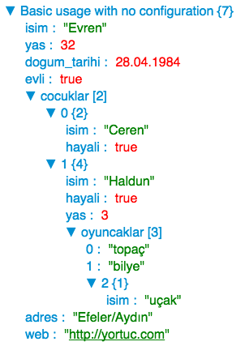

## Json-Tree Rendering Component for React

Visualize JSON string and js objects with customizable rendering api.

Install

```
npm install iso-json-tree@latest
``` 

Also include the css file: `node_modules/iso-json-tree/lib/JsonTree.css`

### Basic usage with no setup
```javascript
var jsonData = {
  isim: "Evren",
  yas: 32, 
  dogum_tarihi: "1984-04-28",
  evli: true,
  cocuklar: [
    { isim: "Ceren", hayali: true },
    { 
      isim: "Haldun", 
      hayali: true, 
      yas: 3, 
      oyuncaklar: ["topaç", "bilye", {isim: "uçak"}] 
    }
  ],
  adres: "Efeler/Aydın",
  web: "http://yortuc.com"
};
```
Render
```jsx
<JsonTree data={json} />
```



### Custom rendering rules
You can add your own rendering rules and specify how to render a particular pattern.
Json-Tree component uses default rule set. When you provide a new array of rules, 
these are prepended and given priority.

Data
```javascript
var photoAlbumData = {
  album_adi: "Davutlar tatili",
  tarih: "2011-07-23",
  images: [
    "http://4.bp.blogspot.com/-iGaS62JllxM/Tpb19oQYv4I/AAAAAAAAA8s/b_4pGv6ly4A/s1600/davutlar1%25281%2529.jpg",
    "http://www.oteldenal.com.tr/media/sub_domain/buyuk/spot_davutlar_08180033_ar1.jpg",
    "http://r3.emlak.net:8080/2010/07/14/535b7d36f1cb261299b822e4011e537c.jpg"
  ]
};
```

Custom rules array 
```jsx
const photoRules = [
	(name,value)=> typeof value === "string" && (new RegExp("(http(s?):)|([/|.|\w|\s])*\.(?:jpg|gif|png)").test(value)) ? 
					<div className="JsonTree-Node-Item">
		              <div className="JsonTree-Node-Key">{name} : </div>
		              <div className="JsonTree-Node-Value">
		              	<a href={value} target="_blank"></a>
		              </div>
		            </div> : null
];
```

And render
```jsx
<JsonTree data={photoAlbum} rules={photoRules} />
```


Custom rules is an array of functions wich take two arguments: name and value.
These functions are called before rendering of each key-value pair in json tree sequentially. If any match occurs, result is returned immediately. In the above custom image rendering example, first we check if the value is type of string. And then check the value if it's a valid image url string with help of a simple regex. Then return custom result. You need to follow the class structure not to break overall layout. 

### Iterator support
Now iso-json-tree cheks if any given ´value´ is an iterator, converts it to an array and renders properly.

### Function support
Since iso-json-tree can render both Json strings ans JavaScript objects, if and object contains function, now it will be rendered accordingly. 

```javascript
const api = {
  description: "Api methods",
  getSongs: function(artistId, albumId) {
    // return promise
    return fetch("api/artist/"+artistId+"/album"+albumId+"/songs");
  },
  getCover: function(albumId){
    // return promise
    return fetch("api/album/"+albumId); 
  }
};
```

```jsx
<JsonTree data={api} />
```


## Roadmap
✓ Customizable rendering api

✓ Support for [iterable protocol](https://developer.mozilla.org/en-US/docs/Web/JavaScript/Reference/Iteration_protocols#iterable)

✓ Support for function rendering

▢ Tests

▢ Support arrow and anonymous functions, code formatting

▢ Theming with [base16](https://github.com/chriskempson/base16)
